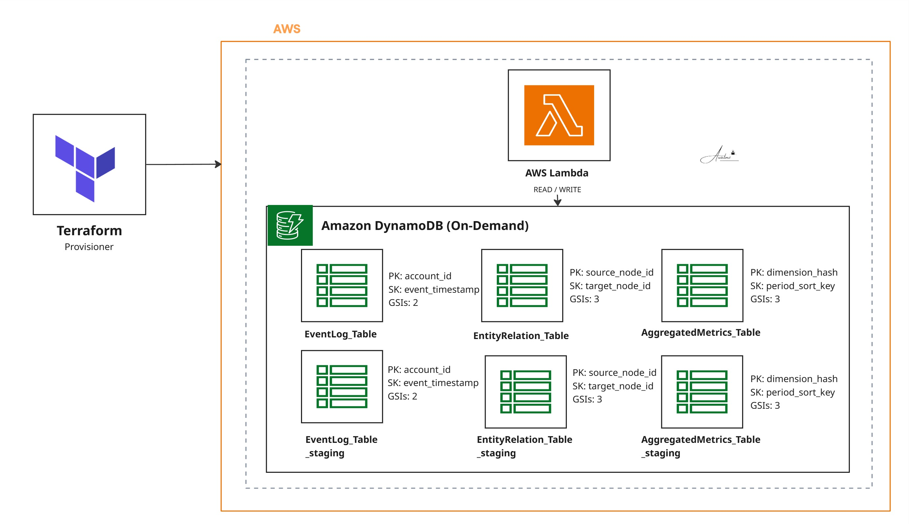

# Project 19: DynamoDB Registry Terraform

A Terraform module that provisions six DynamoDB tables across three data registries, each with a production and staging counterpart. The schema is purpose-built around three different access patterns: graph traversal, time-series event lookup, and precomputed analytics ranking. Each table is paired with the specific Global Secondary Indexes that its workload actually uses, no catch-all scans.

Both environments are built from the same Terraform code. Staging always mirrors production by construction, which removes a common source of drift between the two.

## Architecture



## Tables and Indexes

| Table | PK / SK | GSIs |
|---|---|---|
| `EntityRelation_Table` (+ `_staging`) | `source_node_id` / `target_node_id` | `GSI_AllKey`, `source_node_index`, `target_node_index` |
| `EventLog_Table` (+ `_staging`) | `account_id` / `event_timestamp` | `GSI_Batch_Index`, `GSI_correlation_index` |
| `AggregatedMetrics_Table` (+ `_staging`) | `dimension_hash` / `period_sort_key` | `GSI_metric_alpha_index`, `GSI_metric_beta_index`, `GSI_metric_gamma_index` |

**`EntityRelation_Table`** models a directed graph between primary and secondary entities. `source_node_index` lists every target a given source connects to. `target_node_index` lists every source connected to a given target. `GSI_AllKey` provides a full cross-cut for backend auditing.

**`EventLog_Table`** is an immutable time-series ledger. `GSI_Batch_Index` surfaces events grouped by processing batch. `GSI_correlation_index` resolves an event flow by its public correlation ID.

**`AggregatedMetrics_Table`** holds precomputed analytics. The three GSIs (`alpha`, `beta`, `gamma`) rank metrics along different dimensions for reporting dashboards and health monitoring.

## Stack

Terraform 1.x · AWS DynamoDB (on-demand billing)

## Deployment

```bash
terraform init
terraform plan
terraform apply
```

## Teardown

```bash
terraform destroy
```

Take a point-in-time backup or export to S3 before destroying. This operation is irreversible.

## Notes

- All tables use `PAY_PER_REQUEST` billing. If traffic patterns stabilise, switching to `PROVISIONED` with autoscaling will usually reduce cost.
- Every write to a base table also writes to each of its GSIs. Review GSI usage before adding new indexes; unused indexes still cost write capacity.
- The `_staging` suffix on table names keeps staging and production isolated within the same AWS account, while still being deployed from a single Terraform apply.
